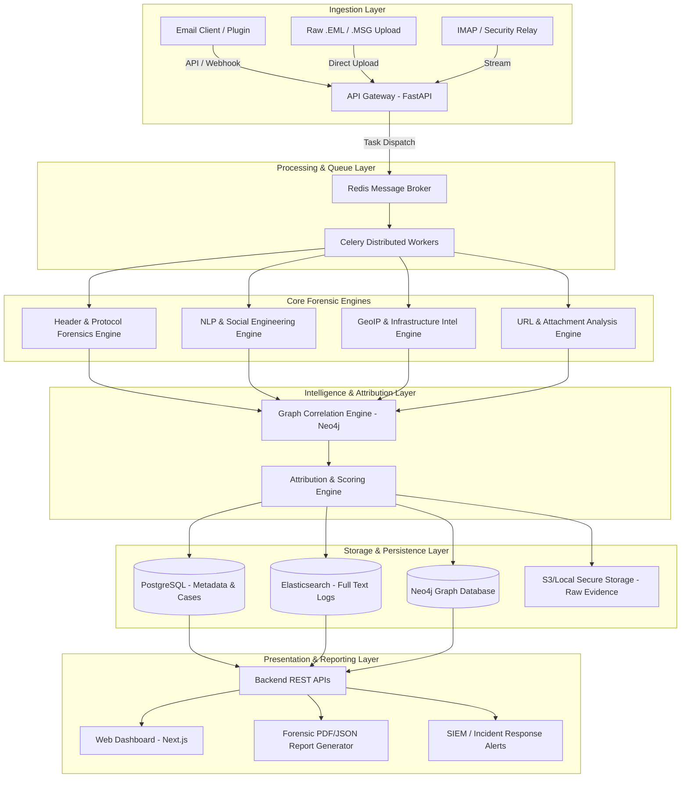
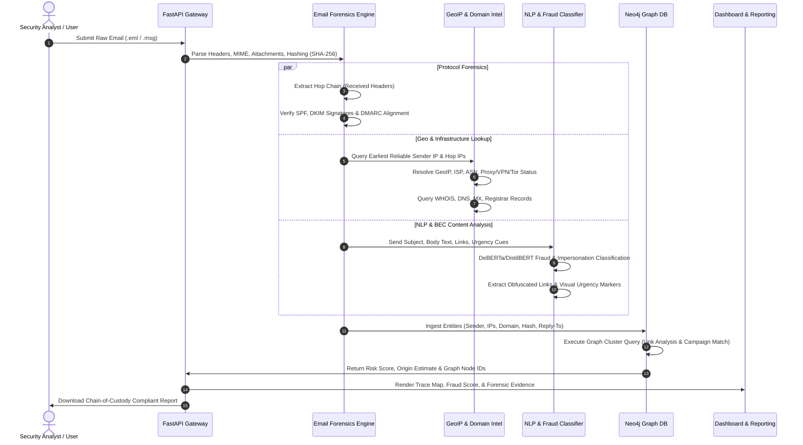
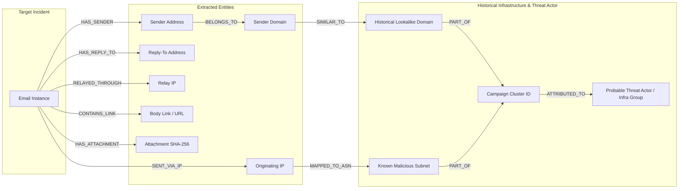
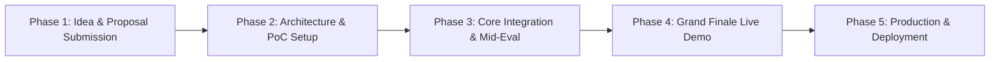

# SIH 2026 Problem Statement 26106: Email Threat & Forensic Intelligence
## Architecture Design, Tech Stack, & Execution Plan

---

## 1. Executive Summary & Problem Context
* **Problem Statement ID:** 26106
* **Title:** Email Threat & Forensic Intelligence
* **Domain:** Cybersecurity / Threat Intelligence / Cyber Forensics
* **Objective:** Build an AI-powered platform that ingests raw email communications (`.eml`, `.msg`), conducts deep header and transmission protocol forensics, analyzes content via NLP/ML for advanced phishing/BEC, maps hop-by-hop relay paths with IP geolocation, correlates entities using graph databases for threat actor attribution, and outputs automated forensic evidence reports.

---

## 2. System Architecture & Flow

### 2.1 High-Level Architecture Diagram

---

### 2.2 Forensic Analysis Pipeline Workflow

---

### 2.3 Threat Attribution Graph Model

---

## 3. Technology Stack Selection

| Component | Technology / Library Chosen | Justification / Purpose |
| :--- | :--- | :--- |
| **Primary Language** | Python 3.11+ | Ecosystem dominance in ML, Cyber Forensics, and Data Pipelines |
| **API Framework** | FastAPI | Asynchronous performance, auto-generated OpenAPI specs, Pydantic data validation |
| **Async Task Engine** | Celery + Redis | Asynchronous background processing for heavy email parsing, WHOIS, and ML inference |
| **Email Forensics** | `eml_parser`, `mailparser`, `dnspython`, `dkimpy` | Deep header extraction, RFC parsing, SPF/DKIM verification, and DNS validation |
| **IP Intelligence** | MaxMind GeoLite2 API, `python-whois`, AbuseIPDB API | IP-to-location mapping, ISP/ASN detection, proxy/VPN flag identification, WHOIS lookup |
| **NLP & Fraud AI** | PyTorch, Transformers (`DeBERTa-v3`, `DistilBERT`), Scikit-Learn | Real-time classification of urgency, financial diversion, impersonation, and zero-day phishing |
| **Graph Database** | Neo4j + Cypher Query Language | Graph relationship mapping between domains, IPs, senders, and campaign clusters |
| **Relational Storage** | PostgreSQL | Metadata storage, case management, user roles, and audit trail retention |
| **Search Engine** | Elasticsearch | High-speed full-text search across parsed body texts and historical raw headers |
| **Frontend Framework** | Next.js (React) + TailwindCSS | Responsive analyst UI, server-side rendering, dynamic interactive state management |
| **Visualizations** | Leaflet.js / Mapbox GL, Vis.js / Cytoscape.js | Interactive geographical trace maps and graph network cluster diagrams |
| **Security & Custody** | SHA-256 Hashing, AES-256 Encryption, JWT Auth | Chain-of-custody tracking, secure log storage, and Role-Based Access Control (RBAC) |
| **Containerization** | Docker, Docker Compose | One-command deployment, reproducible development, and multi-service orchestration |

---

### 4. Key System Modules & Technical Responsibilities

### 4.1 & 4.2 Module 3: Header Parsing & Protocol Forensics Engine (`MOD-03`)
* Ingest staged `.eml` and `.msg` files.
* Extract all RFC 822 / 2822 standard and extended headers (`Received`, `Return-Path`, `Message-ID`, `X-Originating-IP`, `Authentication-Results`).
* Calculate cryptographic hashes (MD5, SHA-256) of raw email stream and attachments for evidentiary integrity.
* Parse and order multi-hop `Received` headers from bottom (origin) to top (destination), supporting both IPv4 and IPv6 patterns.
* Verify DKIM cryptographic signatures and check SPF mechanism alignment (`PASS`, `FAIL`, `SOFTFAIL`, `NEUTRAL`, `NONE`, `TEMPERROR`, `PERMERROR`).
* Evaluate DMARC compliance policy enforcement (`reject`, `quarantine`, `none`).
* Detect display name spoofing, relay manipulation, forged Message-IDs, and missing hop signatures.

### 4.3 Module 4: GeoIP & Infrastructure Intelligence (`MOD-04`)
* Extract the earliest reliable originating public IP address (filtering private/internal RFC 1918, loopback, and CGNAT IPs). If `raw_hop_chain` is `None` during parallel execution, independently parse `Received` headers from raw `.eml`/`.msg`.
* Resolve geographic metadata: Country, City, Coordinates, ISP, Autonomous System Number (ASN).
* Flag infrastructure anomalies: Known VPN nodes, Tor exit nodes, public cloud relays (AWS/GCP/Azure), open relays, and residential proxies.
* Execute WHOIS and DNS lookups for sender domain creation age, registrar details, MX record alignment, and typosquatting/homograph checks against target brand dictionaries.

### 4.4 Module 5: NLP & Fraud Detection Engine (`MOD-05`)
* Extract textual semantic features, urgency indicators, financial/payment diversion cues, and credential harvesting patterns from sanitized body text (truncating to 512 tokens max).
* Classify content using CPU-quantized ONNX models (`LEGITIMATE`, `PHISHING`, `BEC_FINANCIAL`, `CREDENTIAL_HARVESTING`, `IMPERSONATION`).
* Inspect embedded links, unshorten redirect chains up to 5 hops with SSRF IP filtering (blocking RFC 1918 / internal redirect targets), and flag suspicious TLDs.

### 4.5 Module 6: Graph Correlation, Threat Attribution & Persistence Engine (`MOD-06`)
* Act as sole write authority for Neo4j, PostgreSQL, and Elasticsearch.
* Store atomic indicators (IPs, domains, hashes, email addresses, campaign tags) as nodes in Neo4j using idempotent `MERGE` clauses.
* Establish weighted relationships (`[:HAS_SENDER]`, `[:BELONGS_TO]`, `[:SENT_VIA_IP]`, `[:RELAYED_THROUGH]`, `[:CONTAINS_LINK]`, `[:HAS_ATTACHMENT]`, `[:LINKED_TO_CAMPAIGN]`, `[:HAS_REPLY_TO]`).
* Compute final unified `composite_score` (0.0 - 100.0) and threat level.
* Run scoped community detection algorithms (`[:SENT_VIA_IP|:HAS_ATTACHMENT|:CONTAINS_LINK*1..3]`) to group emails into attack campaigns without query path explosion.

### 4.6 Module 1 & Module 2: Analyst Dashboard & Forensic Reporting Engine (`MOD-01`, `MOD-02`)
* Module 1 (Next.js Dashboard): Visual Hop Trace map, composite Risk Matrix, Cytoscape network graph, and raw RFC header inspector.
* Module 2 (FastAPI Gateway): Sole REST network boundary, Celery task orchestrator (chord execution), graph proxy endpoint (`GET /api/v1/cases/{case_id}/graph`), and ReportLab tamper-evident PDF / JSON evidence report exporter.
* Evidence Staging: Shared storage volume (`EVIDENCE_STAGING_DIR`) ensuring seamless evidence file access across containerized Celery worker containers.

---

## 5. SIH Process Execution Plan & Requirements Staging

> **Note:** As specified, the following sections outline the specific technical and operational requirements for each stage of the SIH journey without generating redundant boilerplate text.

### Phase 1: Idea Submission & SIH Internal Screening
**Requirements:**
* **Problem Definition Alignment:** Precise mapping of PS 26106 objectives into technical sub-modules.
* **Proposed Architecture Schematic:** Diagram illustrating ingestion, parsing, ML inference, Neo4j correlation, and presentation layer.
* **Tech Stack Finalization:** Selection of open-source, non-proprietary tools and models to ensure rapid execution.
* **Feasibility & Novelty Justification:** Explanation of how graph-based attribution + hop-by-hop GeoIP surpasses static spam filters.
* **Presentation Deck (PPT):** 5-7 slide deck covering problem context, proposed solution, flow diagram, tech stack, and expected outcomes.

---

### Phase 2: Architecture & Proof of Concept (PoC) Development
**Requirements:**
* **Parser Engine PoC:** Python script capable of extracting headers and validating SPF/DKIM from sample `.eml` files.
* **Basic GeoIP Pipeline:** Integration of MaxMind GeoLite2 DB to resolve sample header IP addresses to coordinates.
* **Initial ML Classification Model:** Fine-tuned baseline NLP classifier (DistilBERT/TF-IDF + Scikit-Learn) trained on public phishing datasets.
* **Graph Schema Definition:** Basic Neo4j schema establishing `Email`, `Sender`, `IP`, and `Domain` node labels and relationship edges.
* **Wireframe & UI Design:** Basic analyst dashboard layout wireframes in Figma or Next.js layout template.

---

### Phase 3: Core Engine Integration & Mid-Evaluation Readiness
**Requirements:**
* **End-to-End Async Pipeline:** FastAPI + Redis + Celery integration for handling asynchronous parsing and inference tasks.
* **Header Hop Tracer:** Algorithm to parse multi-hop `Received` headers, strip internal IPs, and reconstruct true routing topology.
* **Domain Intelligence Module:** Automated WHOIS and DNS record fetcher with domain age calculation and homograph spoofing detection.
* **Interactive Frontend Map & Graph:** Next.js UI integration with Leaflet.js (for map trace) and Vis.js/Cytoscape.js (for graph visualizer).
* **Synthetic Test Dataset:** A curated dataset containing legitimate, spoofed, BEC, and multi-hop phishing emails for evaluation.

---

### Phase 4: Grand Finale Live Working Prototype (Hackathon Final)
**Requirements:**
* **Real-time Live Ingestion:** Functional file drag-and-drop upload and REST API endpoint processing under 3 seconds per file.
* **Dynamic Threat Scoring Engine:** Calculated composite risk score (0-100) displaying exact breakdown reasons.
* **Interactive Campaign Clustering:** Live graph query in Neo4j demonstrating linking of multiple submitted emails to the same attacker infrastructure.
* **Automated Forensic PDF Generator:** One-click generation of court-ready/law-enforcement-oriented PDF forensic reports with SHA-256 hashes.
* **Role-Based Access & Privacy Masking:** RBAC setup with PII masking options for user compliance and privacy standards.
* **Stress Testing & Docker Package:** Containerized setup (`docker-compose up`) ensuring zero-configuration deployment for judges.

---

### Phase 5: Post-Hackathon Hardening & Enterprise Deployment
**Requirements:**
* **SIEM / SOAR Integration:** Webhooks and Syslog/CEF export for integration with Splunk, Microsoft Sentinel, and QRadar.
* **Live Threat Feed Integration:** Real-time sync with threat intelligence feeds (AbuseIPDB, VirusTotal, ThreatFox, AlienVault OTX).
* **Active Mail Server Plugin:** Development of lightweight milter/plugin for Microsoft 365, Google Workspace, or Postfix.
* **High Availability & Scalability:** Kubernetes deployment manifests, load balancer configurations, and database replication setups.
* **Legal & Regulatory Compliance:** Alignment with ISO 27001, CERT-In compliance mandates, and evidentiary standards for digital forensics.

---

## 6. Performance & Evaluation Metrics Matrix

| Evaluation Domain | Metric / Indicator | Target Benchmark |
| :--- | :--- | :--- |
| **Processing Speed** | EML Ingestion to Report Output | < 2.5 seconds per email |
| **Detection Accuracy** | Phishing / BEC Classification Precision & Recall | > 96% Precision, > 94% Recall |
| **Geo Origin Accuracy** | First Public Hop IP Extraction & Geo Resolution | > 98% accurate public node extraction |
| **Spoofing Detection** | Header Anomaly & Alignment Validation | 100% detection of SPF/DKIM/DMARC failures |
| **Graph Scaling** | Node & Edge Query Latency (Neo4j) | < 200ms for 100,000 nodes |
| **Deployment Readiness** | Docker Orchestration Execution Time | Clean launch via `docker-compose up` in < 2 mins |

---
